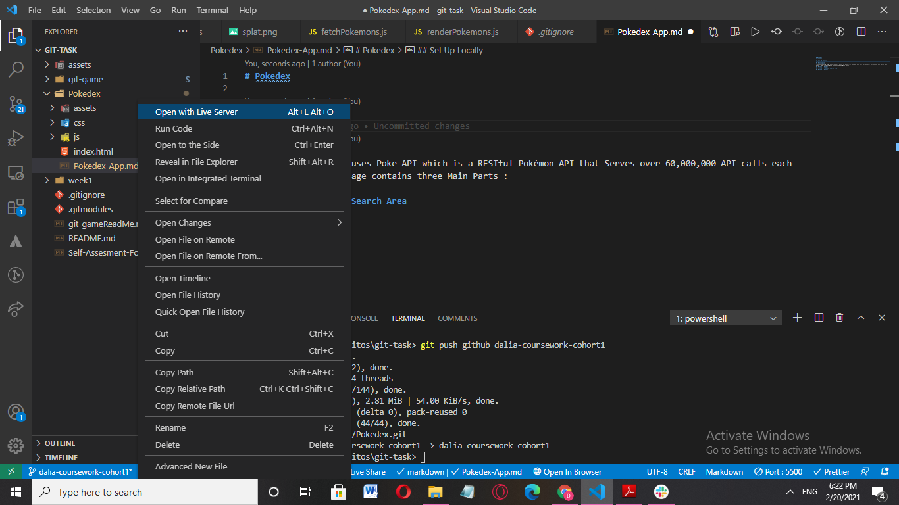
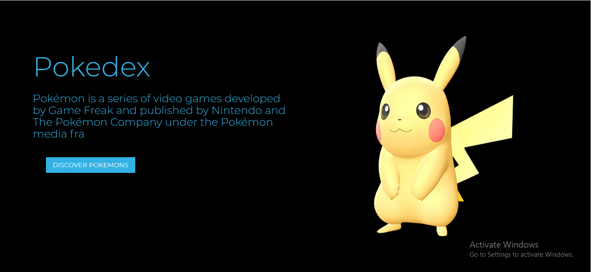
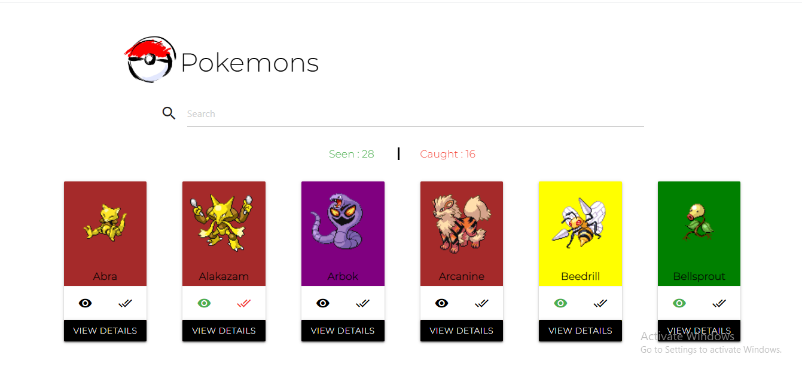
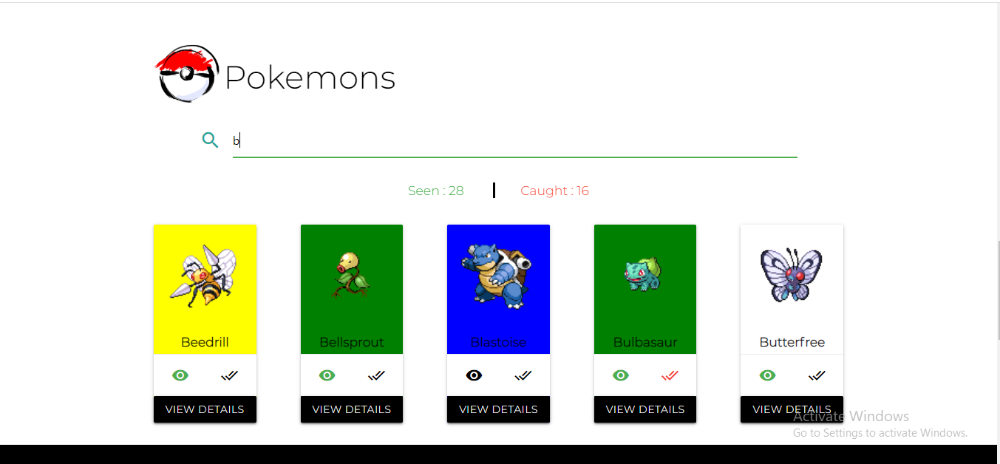
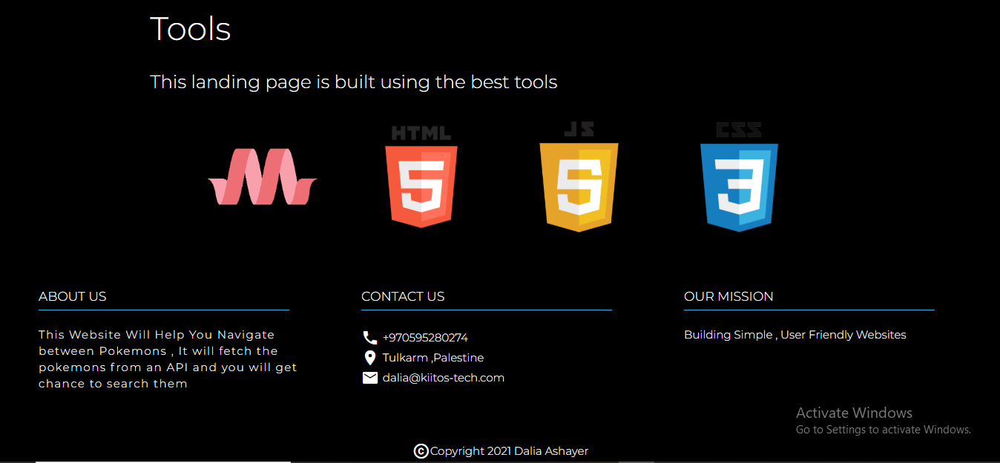

# Pokedex

## Set Up Locally

After installing the folder , you can run the project using Live Server as shown in the image below :

## Code Sandbox

You can view the project in CodeSandbox :
https://codesandbox.io/s/quirky-breeze-48sbf

## Description

Pokedex Landing Page uses Poke API which is a RESTful Pokémon API that Serves over 60,000,000 API calls each month . The Landing Page contains four Main Parts :

## Part 1 : Header

## Part 2 : Random Pokemons Area

when the user view the detail the modal will pop up:

## Part 3 : Pokemons Search Area

This area contains 100 sorted pokemons that the user can serach by name :

## Part 4 : Footer

