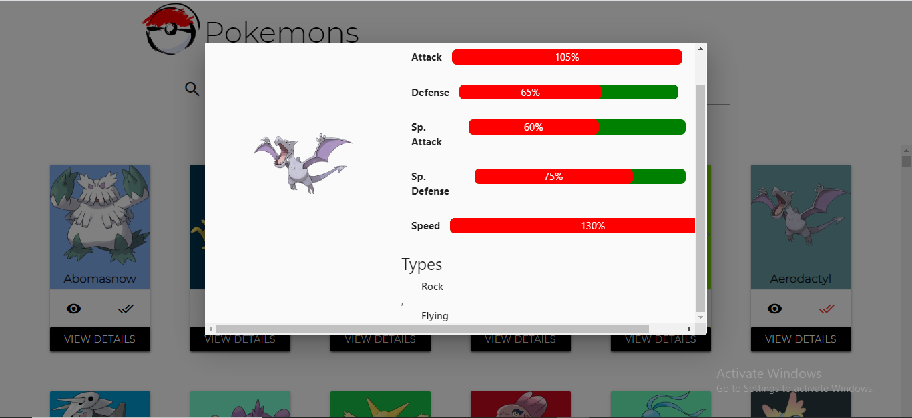

# Pokedex

## Set Up Locally

After cloning the project :
git clone https://yourBitBucketAccount/kiitos/tap-cohort-1.git
git fetch
git checkout dalia-coursework-week2
You can run the project using Live Server as shown in the image below :

## Code Sandbox

You can view the project in CodeSandbox :
https://codesandbox.io/s/stoic-hawking-zcje0

## MVC Pattern

I achieved the MVC Pattern by separating the front end from the backend and the backend is RESTFull API which serves all kind of requests from different clients by transferring JSON Data and sending the request to the same endpoint , but with different method .

## Description

Pokedex Landing Page uses fetches the data from the Restful API backend server that I built using Node JS and Express JS . The Landing Page contains four Main Parts :

## Part 1 : Header

## Part 2 : Random Pokemons Area

when the user view the detail the modal will pop up:

## Part 3 : Pokemons Search Area

This area contains 100 sorted pokemons that the user can serach by name :

## Part 4 : Footer

